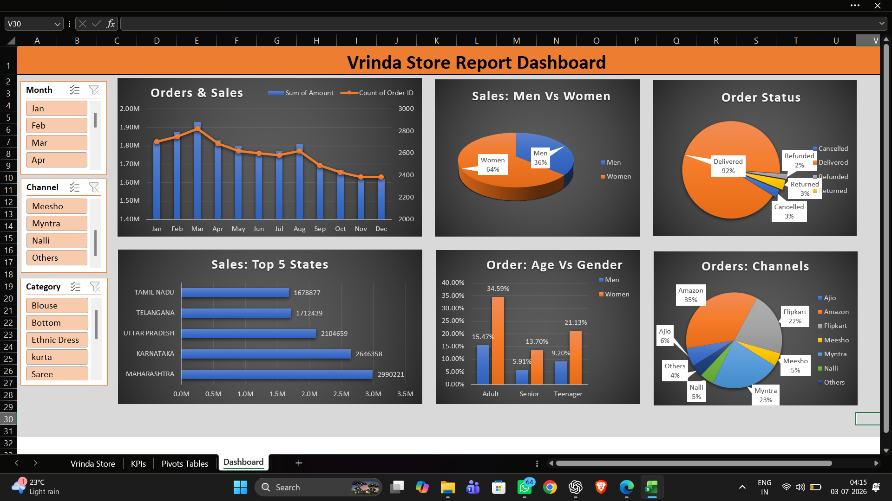

📊 Vrinda Store Sales Dashboard

# Project Overview

This project is an interactive Excel Sales Dashboard created to analyze Vrinda Store's sales performance. It helps visualize sales trends, customer behavior, order status, and regional performance using Pivot Tables, Pivot Charts, Slicers, and KPIs.

---

# Dashboard Preview

---

# Objectives

- Analyze monthly sales performance
- Identify top-performing states
- Compare sales by gender
- Analyze order status
- View sales across different channels
- Understand customer age groups

---

## Tools Used

- Microsoft Excel
- Pivot Tables
- Pivot Charts
- Slicers
- Conditional Formatting
- Data Cleaning

---

## Dashboard Features

- Monthly Sales Trend
- Sales vs Orders Analysis
- Gender-wise Sales
- Age Group Analysis
- State-wise Sales
- Sales Channel Distribution
- Order Status Summary
- Interactive Slicers

---

## Key Insights

- Women contribute the highest sales.
- Maharashtra is the top-performing state.
- Amazon generates the highest number of orders.
- Adult customers contribute the maximum revenue.
- Most orders are successfully delivered.

---

## Skills Demonstrated

- Data Cleaning
- Data Analysis
- Dashboard Design
- Data Visualization
- Business Insights
- Excel Reporting

---

## Author

**Rutuja Jadhav**

Aspiring Data Analyst

